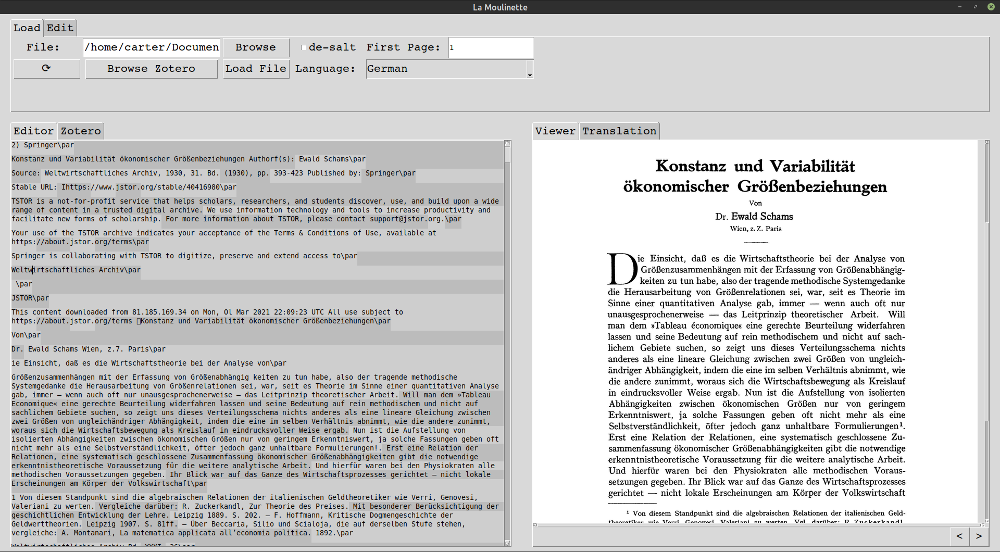

# La Moulinette

This is GUI a program in Python/tkinter I made to streamline the process of translating articles written in a foreign language (I used it mostly for Dutch and German).
A "Moulinette" is a kitchen utensil in which you put food to be grinded/chopped, rotate a crank and voilà! a finished product comes out.

## Layout
The basic layout is split in two windows, one to edit the original text, the other where the pages of the original pdf appear. A toolbar on top allows the user to load files ("Load" panel) and gives some editing shortcuts ("Edit" panel).

## Workflow
A file can be loaded directly from Zotero (where I keep most of the academic papers and archives I work on), or a previous file can be loaded.
Once a file is loaded, the basic thing is to verify that the text has been read correctly in the left panel (I use the ocr tesseract to read the pdf pages), and verify that the phrases automatically recognized are correctly separated (ctrl+p). The phrases are then sent to google translate through the api. Metadata can be changed in the "Zotero" panel of the left editing panel, while on the right one tab shows the translation and the other the pdf pages.

